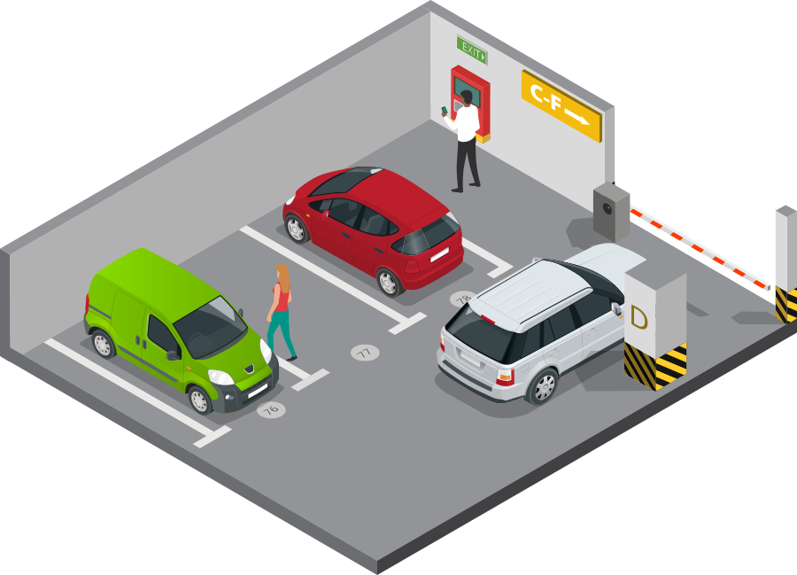

<h1><b>PARKING SYSTEM</b></h1>

<h2><b>ABOUT THE PROJECT</b></h2>

This project was made using Laravel 9.0, inspired on the idea of controlling the parking to receive 
vehicles.

<h2><b>PRE REQUISITES</b></h2>
<ol>
<li><a href="https://www.php.net/manual/en/install.php">PHP</a></li>
<li><a href="https://getcomposer.org/">Composer</a></li>
<li><a href="https://laravel.com/">Laravel 9.0</a></li>
<li><a href="https://nodejs.org/en/">Nodejs</a></li>
<li>A DB, in this case, we used <a href="https://www.heidisql.com/">Heidi SQL</a></li>
</ol>

<h1><b>Steps to run the application</b></h1>
<ol>
<li>Start and create your database.</li>
<li>Clone this project and open on VSCODE or another text editor of your preference</li>
<li>Change on .env archive your database attributes (DB_USERNAME, PASSWORD..)</li>
<li>Made and using the database, run the command <b>php artisan migrate</b></li>
<li>When the migration is done, write <b>php artisan db:seed</b> to get data of our project</li>
<li>Run the command <b>npm run dev</b>, if necessary, run <b>npm install</b> to get the dependencies. It will make you able to get the BOOTSTRAP and style of website.</li>
<li>After it, run <b>php artisan serve</b> to initialize the project and enjoy.</li>
</ol>